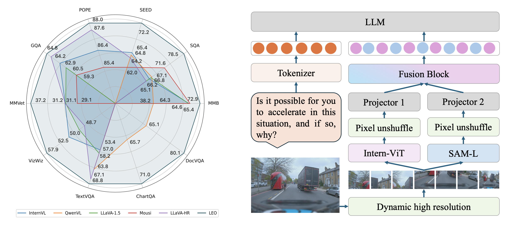
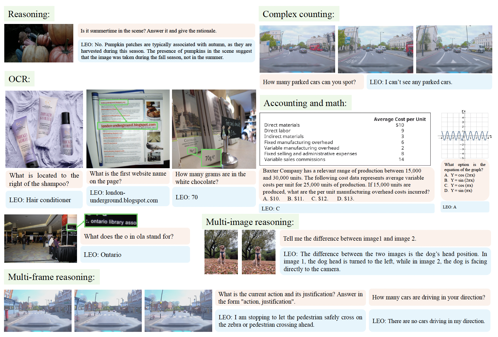

<div align="center">
  
# LEO: Boosting Mixture of Vision Encoders for Multimodal Large Language Models

<div align="center">
  
  <br>
</div>

[](https://github.com/tatsu-lab/stanford_alpaca/blob/main/LICENSE)

</div>


## Introduction

LEO is a powerful hybrid multimodal LLM that leverages a mixture of vision encoders using a post-adaptation fusion strategy and adaptive tiling. For each segmented tile of the input images, LEO sequentially interleaves the visual tokens from its two vision encoders. The resulting model supports multiple images (up to six tiles per image) and outperforms state-of-the-art open-source and hybrid MLLMs on the majority of tasks across 13 multimodal LLM benchmarks, particularly excelling in tasks such as OCR and chart understanding.

<div align="center">

</div>


## News 🚀🚀🚀

- `2025/01/12`: We released the paper and code

## Table of Contents
  - [Performance Comparison with SOTA MLLMs](#Performance-Comparison-with-SOTA-MLLMs)
  - [TODO List](#TODO-List)
  - [Environment](#Environment)
  - [Supervised Fine-tuning](#Supervised-Fine-tuning)
  - [Visualization](#Visualization)

## Performance Comparison with SOTA MLLMs

### Comparison with Leading MLLMs

| Model&nbsp;&nbsp;&nbsp;&nbsp;&nbsp;&nbsp;&nbsp;&nbsp;&nbsp;&nbsp;&nbsp;&nbsp;&nbsp;&nbsp;&nbsp;&nbsp;&nbsp; | ChartQA | DocVQA | VQA<sup>T</sup> | GQA   | VQA<sup>v2</sup> | VizWiz | MMB  | MMMU | POPE | AI2D | SEED | SQA   | MMVet |
|---------------------------------|---------|--------|---------|-------|------------|--------|------|------|------|------|------|-------|-------|
| Instruct-BLIP | -       | -      | 50.1    | 49.2  | -          | 45.5   | 36   | -    | -    | -    | -    | 60.5  | 26.2  |
| InternVL        | -       | -      | 57.0    | 62.9  | 79.3       | 52.5   | 64.6 | -    | 86.4 | -    | 65.4 | 66.2  | 31.2  |
| VILA            | -       | -      | 64.4    | 62.5  | **79.9**   | 57.8   | 68.9 | -    | 85.5 | -    | 61.1 | 68.2  | 34.9  |
| QwenVL            | 65.7    | 65.1   | 63.8    | 59.3  | 79.5       | -      | 38.2 | -    | -    | 62.3 | 64.8 | 67.1  | -     |
| QwenVL-Chat       | 66.3    | 62.5   | 61.5    | 57.5  | 78.2       | -      | -    | -    | -    | 57.7 | -    | 68.2  | -     |
| LLaVA.1.5    | -       | -      | 58.2    | 62.0  | 78.5       | 50.0   | 64.3 | -    | -    | -    | -    | 66.8  | 31.1  |
| LLaVA-Next       | -       | -      | -       | -     | -          | -      | 67.4 | 35.8 | 86.5 | -    | 70.2 | -     | -     |
| **LEO**                          | **71.0**| **80.1**| **68.8**| **64.8** | 78.3   | **57.9**| **72.9**| **36.4**| **88.0**| **69.6**| **72.2**| **78.5**| **37.2** |

**Table Notes**: All models use a 7B language model. 

### Comparison with Leading Hybrid MLLMs

| Model&nbsp;&nbsp;&nbsp;&nbsp;&nbsp;&nbsp;&nbsp;&nbsp;&nbsp;&nbsp;&nbsp; | Fusion&nbsp;&nbsp;&nbsp;&nbsp; | PT&nbsp;&nbsp;&nbsp;&nbsp;&nbsp;&nbsp;&nbsp;&nbsp;  | SFT&nbsp;&nbsp;&nbsp;&nbsp;   | VQA<sup>T</sup>  | GQA    | VQA<sup>v2</sup> | VizWiz  | MMB    | MMMU\_v | MMMU\_t | POPE   | SEED   | SQA    | MMVet  |
|--------------------------------|----------|--------|---------|----------|--------|------------|---------|--------|----------|----------|--------|--------|--------|--------|
| Brave-X5  | Pre-A    | 100 M  | -       | -        | 52.7   | **82.5**   | 54.2    | -      | -        | -        | 87.6   | -      | -      | -      |
| LLaVA-HR  | Pre-A    | 558 K  | 1.2 M   | 67.1     | 64.2   | 81.9       | 48.7    | -      | -        | -        | 87.6   | 64.2   | 65.1   | 31.2   |
| Mini-Gemini | Pre-A    | 1.2 M  | 1.5 M   | 65.2     | 64.5   | -          | -       | 69.3   | 36.1     | 32.8     | -      | -      | 71.1   | **40.8** |
| Mousi     | Pre-A    | 1.2 M  | 1.6 M   | 53.4     | 60.5   | 75.4       | -       | 65.4   | -        | -        | 85.4   | 62.0   | 71.6   | 29.1   |
| **LEO**                 | Post-A   | 595 K  | 1 M     | **68.8** | **64.8** | 78.3     | **57.9**| **72.9**| **36.4** | **33.5** | **88.0**| **72.2**| **78.5**| 37.2   |

**Table Notes**: All models use a 7B language model. **X5**: Denotes a mixture of 5 vision encoders. **Fusion Types**: Pre-A: Pre-adaptation, Post-A: Post-adaptation. 


  
## TODO List

- [ ] release model
- [X] release code
- [X] release paper

## 🛠️ Environment

```bash
git clone https://github.com/Mozhgan91/LEO.git
cd LEO
conda create -n leo python=3.9 -y
conda activate leo
pip install -r requirements.txt
```
- Install `flash attention`:
```bash
pip install flash-attn==2.3.6 --no-build-isolation
```

## Pretrain

We use the same pretraining data as LLaVA v1.5, please download the data from [LLaVA-Pretrain](https://huggingface.co/datasets/liuhaotian/LLaVA-Pretrain).

```bash
GPUS=number_of_gpus PER_DEVICE_BATCH_SIZE=batch_size bash path/to/pretraining/script.sh
```

## Supervised Fine-tuning

Select the appropriate training recipe and follow the instruction below:

```bash
GPUS=number_of_gpus PER_DEVICE_BATCH_SIZE=batch_size bash path/to/finetuning/script.sh
```
For instance, to fully fine-tune LEO 8B model, follow this step which saves the model in 'work_dirs':

```bash
GPUS=8 PER_DEVICE_BATCH_SIZE=1 bash scripts/leo_8b_full.sh
```

## Visualization

<div align="center">

</div><br>

## License

This project is released under the [Apache 2.0 license](LICENSE). Parts of this project contain code and models from other sources, which are subject to their respective licenses.


## Citation
If you find this project useful, please cite our work:
```BibTeX
TBD
```

## Acknowledgement

LEO is built with reference to the code of the following projects: [InternVL](https://github.com/OpenGVLab/InternVL/tree/main), [LLaVA-1.5](https://github.com/haotian-liu/LLaVA), [SAM](https://github.com/facebookresearch/segment-anything/tree/main), [Transformers](https://github.com/huggingface/transformers). We would like to thank them for their great work!

